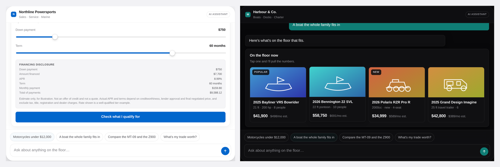

# Vitrine

**Generative UI for conversations that sell.** A white-label chat widget where the model picks components from a typed registry instead of writing prose — and never writes markup.

No build step. No dependencies. No framework. Six files, about 1,600 lines, works from `file://`.

<p align="center">
  
</p>

---

## The idea in thirty seconds

Most "AI chat" is a text box that returns markdown. That is a bad interface for anything transactional. Picking a date, comparing three units, adjusting a down payment — these are not sentences, and rendering them as sentences is why chat widgets convert badly.

Generative UI fixes that, but the naive version — *let the model write JSX* — is untestable, unsafe, and impossible to keep on-brand across tenants.

Vitrine takes the other road, the one behind [Google's A2UI](https://a2ui.org/) and [MCP Apps](https://blog.modelcontextprotocol.io/posts/2026-01-26-mcp-apps/): **the model composes from a catalog the client already trusts.**

```jsonc
// Everything the model is allowed to say. That's the whole wire format.
[
  { "component": "text", "props": { "body": "Four that land under $12,000." } },
  { "component": "unit_carousel", "props": {
      "title": "On the floor now",
      "units": [{ "id": "mt09", "name": "2026 Yamaha MT-09", "price": 10999, "monthly": 189 }]
  }}
]
```

The model decides **what** to show. You decide **how** it looks. A hallucination costs you one dropped card, not an injection.

## Try it

```bash
git clone https://github.com/YOUR-USERNAME/vitrine.git
cd vitrine && open index.html      # that's it — no install, no server
```

The demo ships with a deterministic offline planner, so it works with no API key, no network and no rate limit, and renders identically every time. Paste an Anthropic key in the sidebar to bind the same registry schemas as tools and let a live model drive.

## What's actually interesting here

**The registry is the product.** [`src/registry.js`](src/registry.js) is the entire contract between the model and the interface: eight components, each with a JSON Schema and a description written *for the model*. Nothing else in `src/` knows what a motorcycle is. Swap that one file and the system retargets at hotels, clinics, or apartment leasing.

The same schemas are exported as tool definitions, so the model is constrained by exactly the contract the renderer trusts:

```js
VitrineRegistry.toolSpecs()   // -> [{ name: "render_unit_carousel", input_schema: {...} }, …]
```

One source of truth. No drift between what the model may emit and what the client will draw.

**Nothing from the model reaches `innerHTML`.** Every model-authored string arrives via `textContent` or a typed attribute. There is no code path from a planner response to markup — not a sanitizer, an *absence of the path*.

**Layout never jumps.** Components declare their height in the registry, so the skeleton that lands first occupies exactly the space the hydrated card will take. Text streams character by character with a trailing caret; components arrive as complete units. A chat UI that reflows after a card lands feels broken even when it's correct, and that single property is most of what separates "premium" from "widget".

**White-label is four tokens, and they're validated.** The tenant gets accent, radius, typeface and logo. The host keeps layout, spacing, hierarchy, depth and motion — the parts that actually carry the design. Every accent goes through a contrast gate before it is applied: foreground on accent fills is *chosen* by measured contrast, and an accent that fails WCAG AA against the page surface is darkened in 4% steps until it passes. Try the **Citrus** preset in the demo; it's a real brand yellow that fails out of the box, and you can watch the gate correct it instead of shipping something illegible.

**Compliance lives in the renderer, not the prompt.** `finance_slider` displays a monthly payment, which under Regulation Z is an advertised trigger term. The disclosure — down payment, amount financed, APR, term, total of payments — is recomputed from the same numbers the slider is showing, on every input event, and the schema refuses the card without `apr` and `termMonths`. The registry description tells the model, in as many words, not to route around it by putting a payment in prose. Prompt instructions get ignored; a renderer that can't draw the unsafe thing does not.

## The eight components

| Component | Job |
|---|---|
| `text` | Prose. Two sentences, for voice — never for options. |
| `choice_chips` | 2–5 mutually exclusive quick replies. |
| `unit_carousel` | Scrollable inventory rail, best match first. |
| `unit_compare` | Side-by-side spec table for 2–3 units. |
| `finance_slider` | Payment estimator with an auto-attached Reg Z disclosure. |
| `trade_in` | Four fields in, an indicative range out. |
| `schedule` | Day and time picker. |
| `lead_capture` | Name, phone, email — asked last, never first. |
| `summary_receipt` | Confirmation of a completed action. |

Full payload documentation: [`docs/registry.md`](docs/registry.md).

## Architecture

```
index.html            demo shell — theme switcher, contrast report, live wire inspector
src/registry.js       component schemas + validator + tool-spec export   ← the contract
src/renderer.js       spec -> DOM. Pure, no innerHTML, declares heights
src/theme.js          four tenant tokens + the WCAG contrast gate
src/vitrine.js        conversation loop, streaming, skeleton timing
src/planner.js        MockPlanner (offline, deterministic) + LivePlanner (real model)
src/vitrine.css       host-owned design system; tenant surface at the top
demo/inventory.js     fake dealership feed
```

Data flows one way:

```
user input ──> planner ──> [blocks] ──> validate ──> skeleton ──> render ──> DOM
                  ▲                        │
                  └──── card interaction ──┘   (a tapped card and a typed
                                                sentence are the same event)
```

## Retargeting it

1. Rewrite `src/registry.js` with your domain's components. Write the `description` fields for the model, not for a human — they are prompt surface, and *when not to use this component* earns its place more than what it does.
2. Add a render function per component in `src/renderer.js`, plus a `.height` for the skeleton.
3. Point `LivePlanner.inventoryContext()` at your data.
4. Leave `theme.js`, `vitrine.js` and the layout half of the CSS alone.

## Going live

The demo puts an API key in the browser because a demo with a server is a demo nobody runs. Do not ship that. In production:

- Put the planner call behind your own endpoint. The browser sends a message and a session id; your server holds the key, the system prompt and the inventory context.
- Validate on the server too. `VitrineRegistry.validateBlock` runs in Node unchanged.
- Rate-limit per session, and cap components per turn — a model that emits nine carousels is a bill, not a bug.

## Honest limitations

- **The conversion claim is unproven in this setting.** There is strong academic evidence that people prefer generative interfaces to plain text — [Google Research](https://research.google/blog/generative-ui-a-rich-custom-visual-interactive-user-experience-for-any-prompt/) measures 83–97% preference over markdown and plain text, and [Generative Interfaces for Language Models](https://arxiv.org/abs/2508.19227) (ACL 2026 Findings) finds ~70% across 76 participants on their own real queries. But **no vendor has published a controlled A/B of cards versus text inside a production chat widget.** Not one. Instrument before you believe anything, including this README.
- The mock planner is keyword matching. It is a fixture for the rendering layer, not a dialogue system, and it is not trying to be one.
- No virtualised thread. Past a few hundred turns you'll want one.
- The trade-in valuation is arithmetic on a model year. Wire it to a real book-value service.
- Tested in current Chromium, Safari and Firefox. `color-mix` and `backdrop-filter` degrade gracefully; IE is not a target.

## Prior art worth reading

[A2UI](https://a2ui.org/) · [MCP Apps](https://blog.modelcontextprotocol.io/posts/2026-01-26-mcp-apps/) · [AG-UI](https://github.com/ag-ui-protocol/ag-ui) · [Vercel AI SDK generative UI](https://ai-sdk.dev/docs/introduction) · [Thesys C1](https://www.thesys.dev/)

If you are choosing between these and rolling your own: use one of them for the protocol. Vitrine's contribution is the layer above it — the multi-tenant theming contract, the contrast gate, the skeleton timing, and putting compliance in the renderer instead of the prompt.

## License

MIT.
